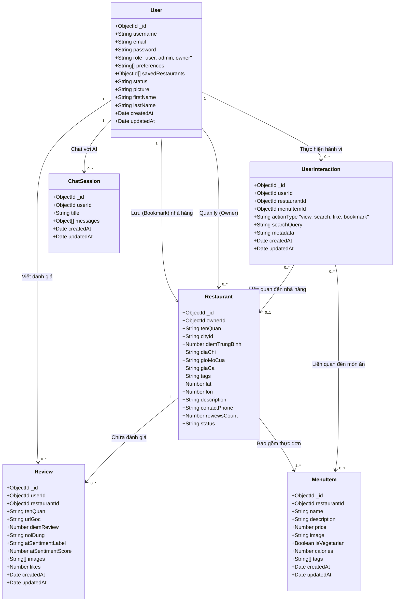

# Thiết kế Cơ sở dữ liệu và Sơ đồ Lớp (Database & Class Diagram)

Tài liệu này mô tả cấu trúc dữ liệu cho hệ thống **GastroWise - Smart Food Recommendation**, được thiết kế để đáp ứng các tiêu chuẩn ở mức độ Senior với sự liên kết dữ liệu chặt chẽ, khả năng cá nhân hóa cao và hỗ trợ đầy đủ cho các thuật toán Gợi ý (Recommendation) cũng như Trợ lý AI.

## 1. Sơ đồ Lớp (Class Diagram)

Dưới đây là biểu đồ Class Diagram thể hiện 6 thực thể cốt lõi của hệ thống: `User`, `Restaurant`, `Review`, `MenuItem`, `UserInteraction`, và `ChatSession`.

## 2. Chi tiết các nâng cấp (Mô hình AI Recommendation)

Để hệ thống thực sự trở thành một bộ máy **Smart Recommendation**, kiến trúc đã được nâng cấp với 6 bảng liên kết chặt chẽ:

1. **User**: Lưu trữ thông tin và cấu hình sở thích (Preferences) dùng cho *Content-based Filtering*.
2. **Restaurant**: Thông tin nhà hàng và chủ sở hữu.
3. **Review**: Phản hồi của người dùng, được AI phân tích cảm xúc (Sentiment Analysis) để làm trọng số cho hệ thống gợi ý.
4. **MenuItem**: Việc gợi ý không chỉ dừng ở cấp độ Nhà hàng mà đi sâu vào từng **Món ăn** để đáp ứng chính xác nhu cầu (ví dụ: món chay, món ít calo).
5. **UserInteraction**: Thu thập dữ liệu hành vi ẩn (Implicit Feedback) như Click, View, Search để xây dựng hệ thống *Collaborative Filtering* mạnh mẽ.
6. **ChatSession**: Lưu trữ ngữ cảnh (Context) của người dùng khi trò chuyện với Trợ lý ảo AI, giúp trợ lý có trí nhớ và đưa ra gợi ý thông minh hơn trong tương lai.
